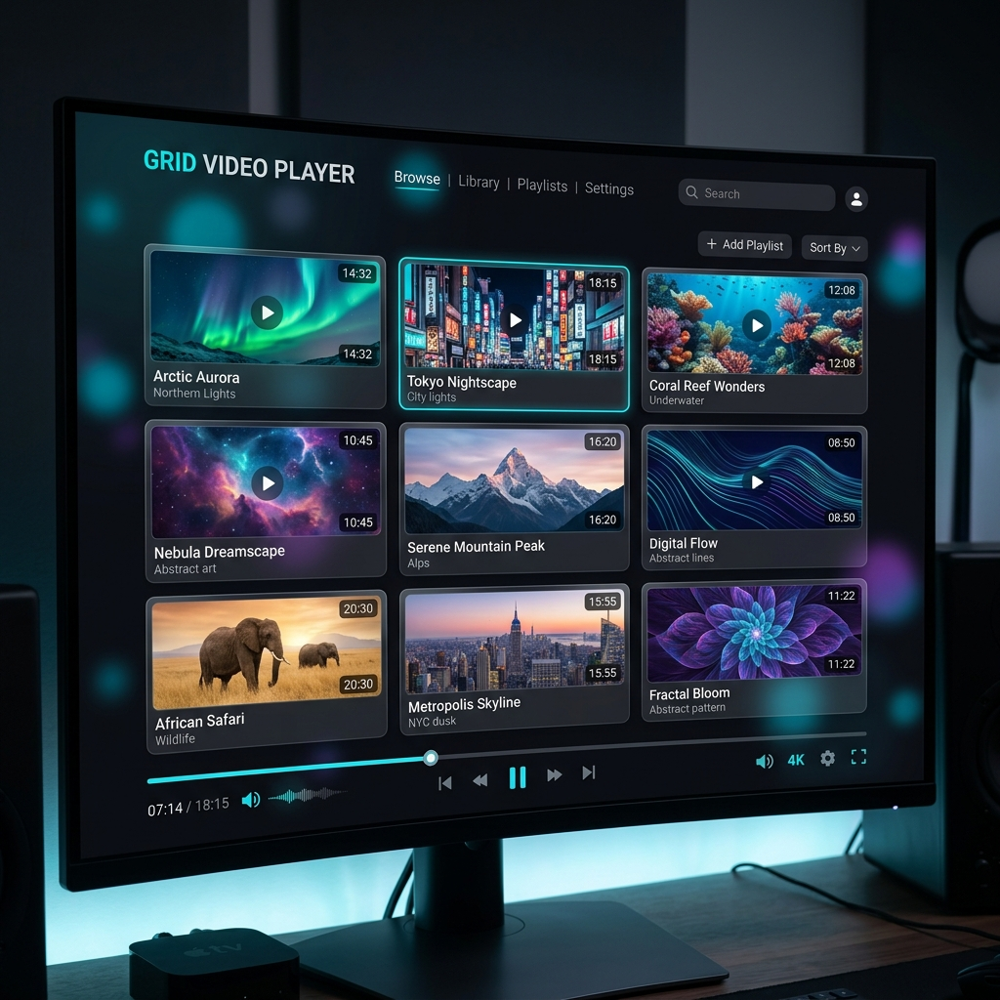

# 🎬 GridVideoPlayer

**GridVideoPlayer** は、複数の動画やアニメーション画像を一つのウィンドウで並列再生・鑑賞するための、究極のメディアプレイヤーです。

## 🌟 概要

「お気に入りの動画を並べて比較したい」「複数のアニメーション素材を一度に確認したい」
GridVideoPlayer は、そんなクリエイターやコレクターのニーズに応えるために開発されました。ウィンドウサイズやアスペクト比に合わせて、最適なグリッドレイアウト（NxM）でメディアを自動配置します。

## ✨ 主な機能

- **🚀 並列再生の極致**: 多数のメディアファイルをタイル状に並べて同時再生。
- **🖼️ 多彩なフォーマット**: 通常の動画形式はもちろん、**アニメーションWebP** や **GIF** にも完全対応。
- **🎨 SkiaSharp レンダリング**: アニメーション画像の再生に SkiaSharp を採用し、極めて低負荷かつ高品質な描画を実現。
- **⚡ パフォーマンス最適化**:
  - **.NET 10** 基盤の最新ランタイムによる圧倒的なレスポンス。
  - 大解像度画像のデコード制限機能で、メモリとCPUをスマートに管理。
  - プロセス優先度の自動調整機能。
- **🖱️ 直感的な操作感**:
  - ファイルやフォルダをドラッグ＆ドロップするだけで即座に開始。
  - マウスホバーで現れる個別コントローラー。
- **📺 一括コントロール**: 全プレイヤーの一時停止、シーク、音量調整を一発で操作。
- **💾 レジューム機能**: 終了時の再生位置を記憶し、次回も続きからスムーズに。

## ⌨️ 操作方法 (ショートカット)

| キー | アクション |
| :--- | :--- |
| `Space` | 全てのメディアを再生 / 一時停止 |
| `F` / `ダブルクリック` | フルスクリーン表示の切り替え |
| `←` / `→` | 全てのメディアを 10 秒シーク (戻る/進む) |
| `↑` / `↓` | 全体の音量を調整 |

## 📥 ダウンロード

最新バージョンは以下のページから入手できます（Windows 専用）。

[👉 GridPlayer Releases](https://github.com/SoraKumo001/GridPlayer/releases)

---
Developed by [SoraKumo](https://github.com/SoraKumo001)

